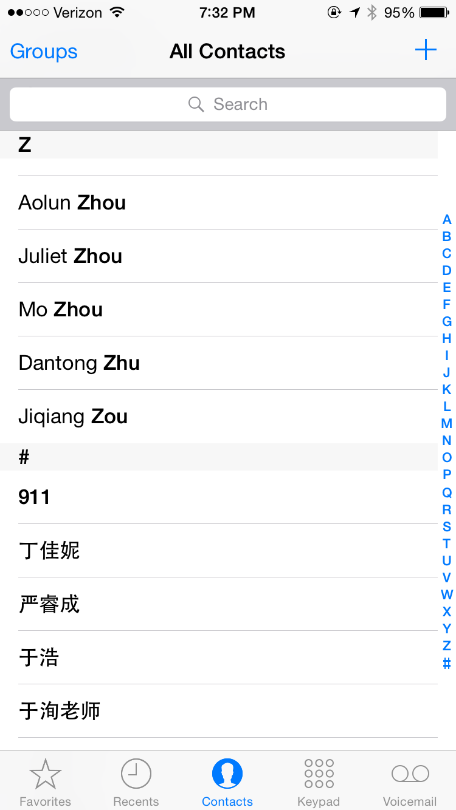
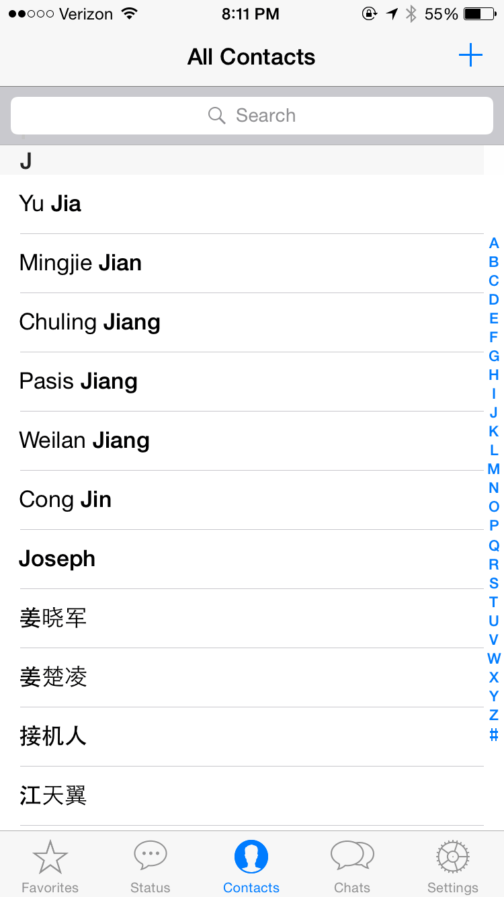
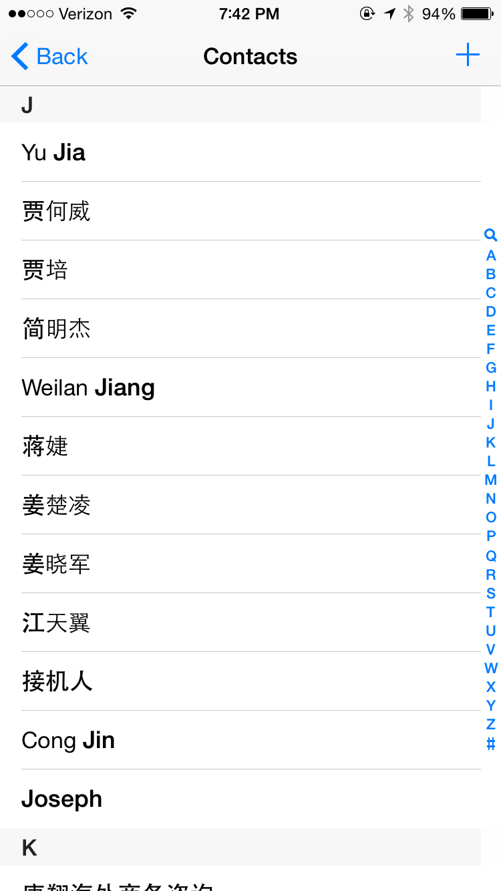
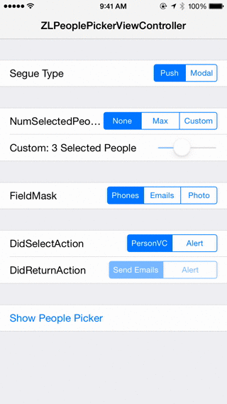
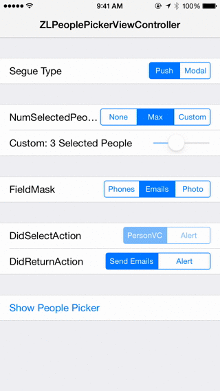
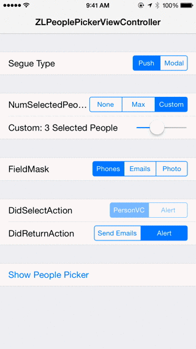

ZLPeoplePickerViewController
============================
A replacement for ABPeoplePickerNavigationController that supports UILocalized​Indexed​Collation. ZLPeoplePickerViewController was originally created for [Talkly](http://zhxnlai.github.io/#/talkly).

Why?
---
ABPeoplePickerNavigationController does not work well with contact names of multiple languages, neither does some address book based app that worths $16 billion. Here are some examples:

</img>

And this is how it should have been:

</img>

Preview
---
###Present ABPersonViewController on select

###Send group emails on return

###Custom Multiple Select

Features
---
- [x] Supports multilingual indexing and sorting by implementing UILocalized​Indexed​Collation using [LRIndexedCollationWithSearch](https://gist.github.com/305676/c128784d22fcf572d3beded690ce84f85449d7c7).
- [x] Supports searching by name, emails and addresses. The results are displayed using UISearchController in iOS 8.
- [x] Supports multiple selection.
- [x] Supports field mask for filtering contacts.
- [ ] Support searching by phone number

CocoaPods
---
You can install `ZLPeoplePickerViewController` through CocoaPods adding the following to your Podfile:

pod 'ZLPeoplePickerViewController'

Usage
---
Check out the [demo app](https://github.com/zhxnlai/ZLPeoplePickerViewController/tree/master/ZLPeoplePickerViewControllerDemo) for an example.

ZLPeoplePickerViewController can be initialized and pushed to navigation controller in a way similar to ABPeoplePickerNavigationController:
~~~objective-c
self.peoplePicker = [[ZLPeoplePickerViewController alloc] init];
self.peoplePicker.delegate = self;
[self.navigationController pushViewController:self.peoplePicker animated:YES];
~~~

There is also a convenience method for presenting the people picker modally.
~~~objective-c
self.peoplePicker = [ZLPeoplePickerViewController presentPeoplePickerViewControllerForParentViewController:self];
~~~

Loading a large address book may take a long time. Therefore ZLPeoplePickerViewController caches it in memory after initialization. You can further reduce the first-time delay by initializing the address book with the following class method in advance (for instance, in `viewDidLoad`).
~~~objective-c
+ (void)initializeAddressBook;
~~~

ZLPeoplePickerViewController uses the `fieldMask` property to filter contacts, graying out those that have missing information. Currently supported fields inlucde emails, photo and addresses.
~~~objective-c
@property (nonatomic) ZLContactField filedMask;
~~~

The `numberOfSelectedPeople` property controls the multiple selection behavior. It indicates the maximum number of people the picker can select at a time.
~~~objective-c
@property (nonatomic) ZLNumSelection numberOfSelectedPeople;
~~~

ZLPeoplePickerViewController can have an optional delegate to receive callback.
~~~objective-c
- (void)peoplePickerViewController:(ZLPeoplePickerViewController *)peoplePicker didSelectPerson:(NSNumber *)recordId {
  // show an ABPersonViewController
  [self showPersonViewController:[recordId intValue] onNavigationController:peoplePicker.navigationController];
}
- (void)peoplePickerViewController:(ZLPeoplePickerViewController *)peoplePicker didReturnWithSelectedPeople:(NSArray *)people {
  // people will be empty if no person is selected
  if (!people || people.count==0) {return;}
  [self presentViewController: [self alertControllerWithTitle:@"Return with selected people:" Message:[[self firstNameForPeople:people] componentsJoinedByString:@", "]] animated:YES completion:nil];
}
- (void)newPersonViewControllerDidCompleteWithNewPerson:(nullable ABRecordRef)person {
    NSLog(@"Added a new person");
}
~~~

Dependencies
---
`ZLPeoplePickerViewController` uses `APAddressBook` internally for accessing address book. It requires [APAddressBook](https://github.com/Alterplay/APAddressBook).

Requirements
---
- iOS 8 or higher.
- Automatic Reference Counting (ARC).

License
---
ZLPeoplePickerViewController is available under MIT license. See the LICENSE file for more info.
